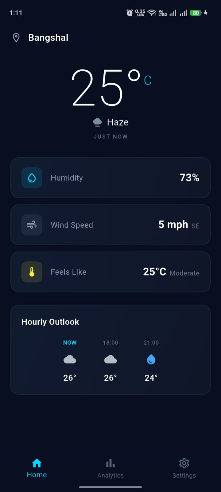
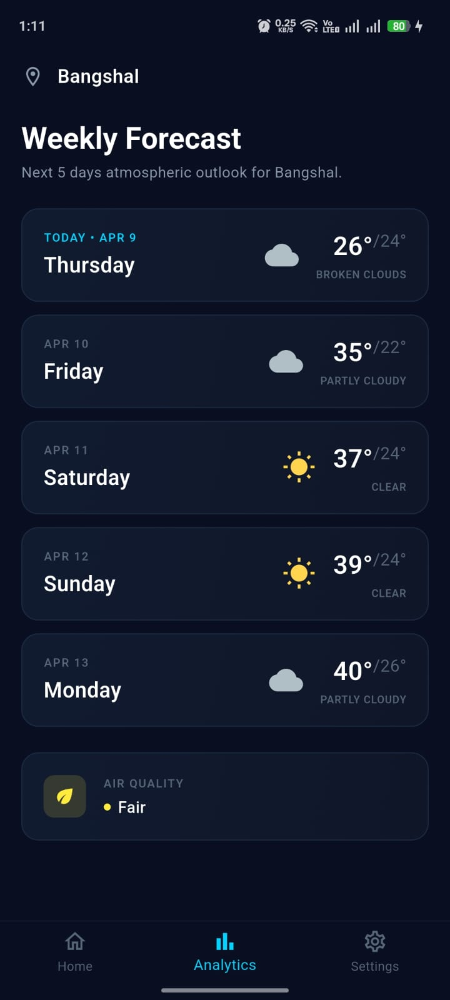
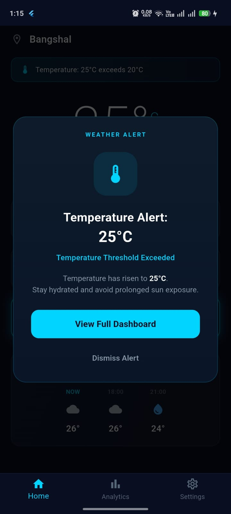
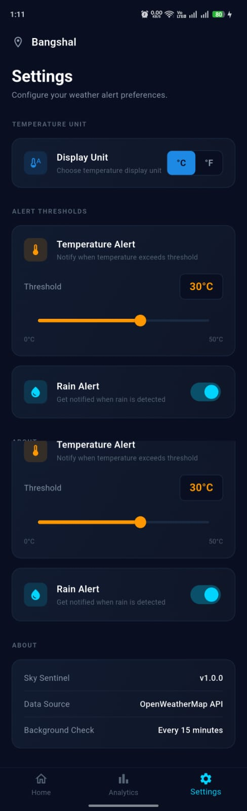
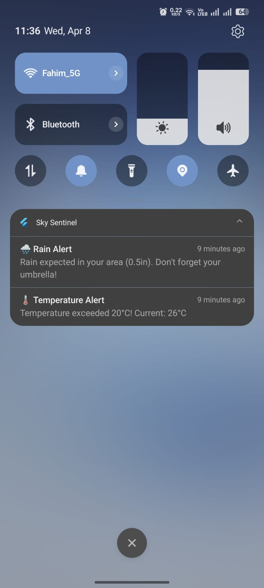
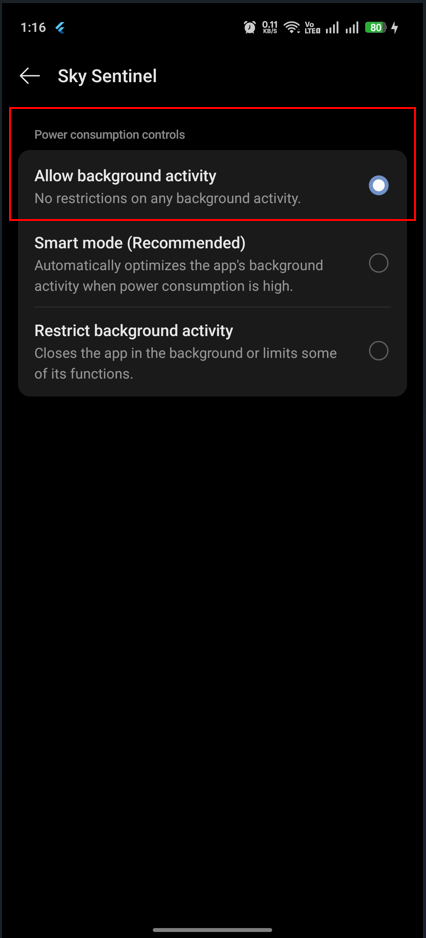

# Sky Sentinel – Weather Alerter App

A Flutter application that monitors real-time weather conditions for the user's current GPS location and delivers push notifications when user-defined thresholds are exceeded — including high temperature warnings and rain alerts with background monitoring.


-orange)

---

## Architecture & Approach

Sky Sentinel is built using **Clean Architecture** with the **BLoC (Business Logic Component) pattern** and the **Repository pattern**, ensuring a clear separation between the UI, business logic, and data layers.

```
┌─────────────────────────────┐
│   Presentation (UI Layer)   │   Pages, Widgets, BLoC
├─────────────────────────────┤
│   Domain (Business Layer)   │   Repository Interfaces
├─────────────────────────────┤
│     Data (Data Layer)       │   Repository Impl, Models, Data Sources
├──────────────┬──────────────┤
│  Remote API  │ Local Cache  │   Dio (OpenWeatherMap) + SharedPreferences
└──────────────┴──────────────┘
```

### BLoC Classes

| BLoC | Responsibility |
|------|---------------|
| **WeatherBloc** | Fetches current weather, 5-day forecast, and air quality data. Manages loading/success/error states and falls back to cached data when the network is unavailable. |
| **LocationBloc** | Handles GPS permission flow and coordinate fetching. Detects disabled location services, denied permissions, and internet connectivity issues. |
| **SettingsBloc** | Manages user-configurable alert thresholds (temperature limit, rain toggle, Celsius/Fahrenheit preference) persisted via SharedPreferences. |

### Key Architectural Decisions

- **Repository pattern** — Each repository abstracts a remote API call and a local cache behind a single interface; on network failure, cached data is returned transparently.
- **Dependency Injection** — All services, data sources, repositories, and BLoCs are registered via `get_it` in a single `injection_container.dart` file.
- **Equatable** — Used across all BLoC states and events for reliable value equality comparisons.
- **Secure API key handling** — The OpenWeatherMap API key is injected at build time via `--dart-define` and never committed to source control.

---

## Project Structure

```
lib/
├── main.dart                          # Entry point — initializes DI, background worker, launches app
├── app.dart                           # App shell — MultiBlocProvider, bottom navigation, alert modal handling
├── injection_container.dart           # GetIt service locator — registers all dependencies
│
├── core/
│   ├── constants/
│   │   ├── api_constants.dart         # OpenWeatherMap API endpoint builders
│   │   └── app_constants.dart         # SharedPreferences keys, notification IDs, defaults
│   ├── errors/
│   │   ├── exceptions.dart            # ServerException, CacheException, LocationException
│   │   └── failures.dart              # Failure types for error propagation
│   ├── theme/
│   │   ├── app_colors.dart            # Dark theme color palette
│   │   └── app_theme.dart             # Material ThemeData configuration
│   └── utils/
│       ├── logger.dart                # Structured logging via logger package
│       ├── temperature_utils.dart     # °F ↔ °C conversion and formatting
│       └── weather_icon_helper.dart   # OpenWeatherMap condition ID → Material icon mapping
│
├── features/
│   ├── weather/
│   │   ├── data/
│   │   │   ├── models/
│   │   │   │   ├── weather_model.dart       # Current weather JSON model
│   │   │   │   ├── forecast_model.dart      # 5-day / 3-hour forecast model (grouped by day)
│   │   │   │   └── air_quality_model.dart   # Air Pollution API model (AQI, PM2.5, PM10)
│   │   │   ├── datasources/
│   │   │   │   ├── weather_remote_datasource.dart   # Dio HTTP calls to OpenWeatherMap
│   │   │   │   └── weather_local_datasource.dart    # SharedPreferences read/write
│   │   │   └── repositories/
│   │   │       └── weather_repository_impl.dart     # Implements WeatherRepository with cache fallback
│   │   ├── domain/
│   │   │   └── repositories/
│   │   │       └── weather_repository.dart          # Abstract repository interface
│   │   └── presentation/
│   │       ├── bloc/
│   │       │   ├── weather_bloc.dart      # Handles FetchAllWeatherData, LoadCachedWeather, alerts
│   │       │   ├── weather_event.dart
│   │       │   └── weather_state.dart     # WeatherInitial → WeatherLoading → WeatherLoaded / WeatherError
│   │       ├── pages/
│   │       │   ├── dashboard_page.dart    # Main dashboard — temperature, info cards, hourly outlook
│   │       │   └── forecast_page.dart     # 5-day forecast cards + air quality indicator
│   │       └── widgets/
│   │           ├── alert_banner.dart           # Inline alert banner on dashboard
│   │           ├── alert_modal.dart            # Full-screen alert overlay (triggered by notification tap)
│   │           ├── hourly_outlook_section.dart # Horizontal scrollable 3-hour forecast
│   │           └── weather_info_card.dart      # Reusable stat card (humidity, wind, feels like)
│   │
│   ├── location/
│   │   ├── data/
│   │   │   ├── datasources/
│   │   │   │   └── location_datasource.dart         # Geolocator + Geocoding calls
│   │   │   └── repositories/
│   │   │       └── location_repository_impl.dart
│   │   ├── domain/
│   │   │   └── repositories/
│   │   │       └── location_repository.dart
│   │   └── presentation/
│   │       └── bloc/
│   │           ├── location_bloc.dart     # Permission handling, GPS fetch, internet check
│   │           ├── location_event.dart
│   │           └── location_state.dart    # LocationLoaded / LocationError / LocationPermissionDenied
│   │
│   ├── settings/
│   │   ├── data/
│   │   │   ├── models/
│   │   │   │   └── alert_settings.dart              # AlertSettings data class
│   │   │   ├── datasources/
│   │   │   │   └── settings_local_datasource.dart   # Persisted settings via SharedPreferences
│   │   │   └── repositories/
│   │   │       └── settings_repository_impl.dart
│   │   ├── domain/
│   │   │   └── repositories/
│   │   │       └── settings_repository.dart
│   │   └── presentation/
│   │       ├── bloc/
│   │       │   ├── settings_bloc.dart
│   │       │   ├── settings_event.dart
│   │       │   └── settings_state.dart
│   │       └── pages/
│   │           └── settings_page.dart     # Temperature threshold slider, rain toggle, unit switch
│   │
│   ├── notifications/
│   │   └── notification_service.dart      # flutter_local_notifications setup, tap handling via stream
│   │
│   └── background/
│       └── background_worker.dart         # WorkManager periodic task (every 15 min)
```

---

## Features

| Feature | Description |
|---------|-------------|
| **Real-time Weather** | Current conditions fetched from OpenWeatherMap `/weather` API |
| **5-Day Forecast** | Daily high/low temperatures, conditions, and hourly breakdowns via `/forecast` API |
| **Air Quality Index** | Real-time AQI with PM2.5 levels from OpenWeatherMap `/air_pollution` API |
| **Smart Alerts** | User-configurable temperature threshold and rain detection with visual alert banners |
| **Background Monitoring** | Periodic weather checks every 15 minutes via WorkManager, even when app is closed |
| **Push Notifications** | High-priority local notifications triggered when thresholds are exceeded |
| **Notification → Alert** | Tapping a notification opens the app and displays a detailed alert modal |
| **Offline Support** | Cached weather data displayed with an offline indicator when network is unavailable |
| **Celsius / Fahrenheit** | User-selectable temperature unit applied across all screens |
| **Pull-to-Refresh** | Swipe down on Dashboard or Forecast to refresh data |
| **Graceful Error States** | Dedicated screens for: no internet, GPS disabled, permission denied — with actionable buttons |
| **Dark UI** | Dark theme with cyan accent designed for readability |

---

## Generative AI Usage

### How AI Was Used

| Phase | How AI Assisted |
|-------|----------------|
| **Architecture** | Designed the Clean Architecture folder structure, defined the BLoC + Repository layering, and set up the dependency injection container. |
| **Core Implementation** | Generated data models, repository interfaces/implementations, BLoC classes, and data source layers based on detailed feature requirements. |
| **UI Development** | Built the dark-themed dashboard, forecast page, settings page, and alert modal following provided design mockups. |
| **Background & Notifications** | Implemented the WorkManager periodic task, notification service with tap-to-alert flow, and cold-start notification handling. |
| **Edge-Case Handling** | Iteratively debugged and fixed real-device issues — GPS disabled states, permission denied flows, no-internet fallback, cached data display, and network error detection. |
| **API Integration** | Integrated OpenWeatherMap Air Pollution API and secured the API key via `--dart-define`. |

### Sample Prompts

- *"Build a complete Flutter application called Sky Sentinel that monitors weather data and sends notifications when conditions meet user-defined thresholds using Clean Architecture with BLoC pattern."*
- *"Implement WeatherBloc with flutter_bloc that fetches current weather and 5-day forecast, handles loading/success/error states, and falls back to cached data on failure."*
- *"Create a background worker using workmanager that runs every 15 minutes, fetches weather data, compares against user thresholds, and triggers flutter_local_notifications."*
- *"Fix the notification tap flow — when a user taps a notification, the app should open and display the corresponding alert modal. Handle both cold-start and runtime scenarios."*

---

## How to Run

### Prerequisites

- Flutter SDK 3.32+ ([Install Flutter](https://docs.flutter.dev/get-started/install))
- Dart SDK 3.8+
- Android Studio or VS Code with Flutter/Dart extensions
- Android device or emulator (API 26+)
- A free OpenWeatherMap API key → [Get one here](https://openweathermap.org/api)

### Steps

1. **Clone the repository:**
   ```bash
   git clone https://github.com/fahimShahriaar/sky_sentinel.git
   cd sky_sentinel
   ```

2. **Install dependencies:**
   ```bash
   flutter pub get
   ```

3. **Run the app** (pass your API key at build time):
   ```bash
   flutter run --dart-define=OWM_API_KEY=your_api_key_here
   ```

4. **Build a release APK:**
   ```bash
   flutter build apk --release --dart-define=OWM_API_KEY=your_api_key_here
   ```
   The APK will be at `build/app/outputs/flutter-apk/app-release.apk`.

5. **Allow background activity (important):**

   Sky Sentinel uses WorkManager to check weather conditions every 15 minutes in the background. On most Android devices, background activity is restricted by default and must be enabled manually:

   - Go to **Settings → Apps → Sky Sentinel → Battery** (or "Battery usage")
   - Set battery optimization to **Unrestricted** (or disable "Battery optimization")
   - On some manufacturers (Xiaomi, Samsung, Huawei, OnePlus), also check **Settings → Battery → Background activity** and ensure Sky Sentinel is allowed to run in the background

   Without this step, the OS may kill the background worker and notifications will not be delivered when the app is closed.

> **Note:** The API key is injected via `--dart-define` and is never stored in source control.

---

## Screenshots

| Dashboard | Forecast | Alert |
|:---------:|:--------:|:-----:|
|  |  |  |

| Settings | Notification | Setup Guide |
|:--------:|:-----------:|:------------:|
|  |  |  |

---

## Tech Stack

| Category | Package | Version |
|----------|---------|---------|
| Framework | Flutter | 3.32 |
| State Management | flutter_bloc | 9.1.0 |
| Networking | dio | 5.7.0 |
| Location | geolocator | 13.0.2 |
| Geocoding | geocoding | 3.0.0 |
| Local Storage | shared_preferences | 2.3.4 |
| Background Tasks | workmanager | 0.9.0 |
| Notifications | flutter_local_notifications | 18.0.1 |
| Dependency Injection | get_it | 8.0.3 |
| Date Formatting | intl | 0.20.2 |
| Logging | logger | 2.5.0 |
| Value Equality | equatable | 2.0.7 |

---

## Error Handling Strategy

| Scenario | Behavior |
|----------|----------|
| **Network failure + cache exists** | Displays cached data with an "offline" banner and allows pull-to-refresh |
| **API error** | Displays error state with the error message and a Retry button |
| **Location services disabled** | Shows "Location Services Disabled" with an Open Settings button |
| **Permission denied** | Shows "Location Permission Required" with Grant Permission / Open App Settings |
| **Permission permanently denied** | Directs user to App Settings with a Retry button |

---

## License

This project is for educational and assessment purposes.
